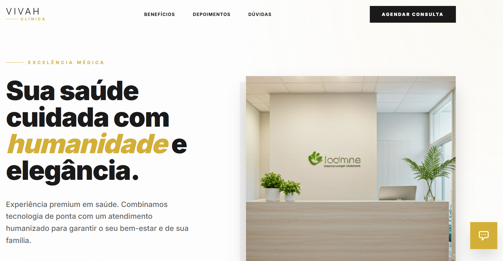

# Vivah Clínica | Excelência e Humanidade 🏥✨



> **Vivah Clínica** é um projeto de interface premium desenvolvido para uma clínica médica de alto padrão. O foco principal é unir a **elegância visual** com uma **experiência do usuário humanizada**, refletindo o compromisso da marca com o bem-estar e a sofisticação.

---

## 💎 Diferenciais do Projeto

Este repositório foi construído seguindo as melhores práticas de desenvolvimento front-end, focado em performance, acessibilidade e estética premium.

- **Design Premium & Imersivo**: Uso de sombras suaves, tipografia refinada (Inter/Outfit) e Micro-interações que elevam a percepção de valor.
- **Assistente Vivah**: Integração com IA (Google Gemini) personalizada para atuar como um concierge virtual da clínica, tirando dúvidas de forma acolhedora.
- **Arquitetura Escalável**: Desenvolvido com React + TypeScript, garantindo tipos estritos e componentes modulares.
- **Responsividade Total**: Experiência fluida em dispositivos móveis, tablets e desktops.

---

## 🛠️ Tecnologias Utilizadas

O projeto utiliza uma stack moderna para garantir alta performance e manutenibilidade:

- **React 19**: Biblioteca core para construção da interface.
- **TypeScript**: Superconjunto JavaScript para tipagem estática e segurança de código.
- **Tailwind CSS**: Framework CSS utilitário para estilização rápida e consistente.
- **Vite**: Ferramenta de build ultra-rápida para o ambiente de desenvolvimento.
- **Google Generative AI**: Motor do Assistente Virtual da clínica.
- **Lucide React**: Biblioteca de ícones elegantes e consistentes.

---

## 🚀 Como Executar o Projeto

Siga os passos abaixo para rodar a aplicação localmente:

### Pré-requisitos
- [Node.js](https://nodejs.org/) (recomendado v18+)
- Uma chave de API do Google Gemini

### Instalação

1. Clone o repositório:
   ```bash
   git clone https://github.com/RobsonFerreira25/Vivah-Cl-nica.git
   ```

2. Instale as dependências:
   ```bash
   npm install
   ```

3. Configure as variáveis de ambiente:
   Crie um arquivo `.env.local` na raiz e adicione sua chave de API:
   ```env
   API_KEY=sua_chave_aqui
   ```

4. Inicie o servidor de desenvolvimento:
   ```bash
   npm run dev
   ```

---

## 📈 Foco em Recrutadores

Este projeto demonstra competências sólidas em:
1. **Integração de APIs de Terceiros**: Implementação do Google Gemini no contexto de negócio.
2. **Desenvolvimento de UI/UX**: Criação de layouts complexos e esteticamente agradáveis sem depender de templates.
3. **Organização de Código**: Estrutura de pastas clara e separação de interesses.
4. **Comunicação de Marca**: Transformação de requisitos técnicos em uma solução que respeita a identidade visual da Vivah Clínica.

---

<div align="center">
  <p>Desenvolvido com ❤️ para o portfólio de <strong>[Seu Nome/Robson Ferreira]</strong></p>
</div>
